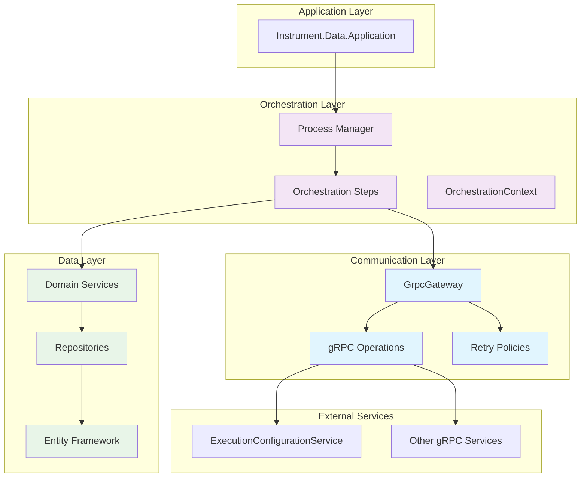
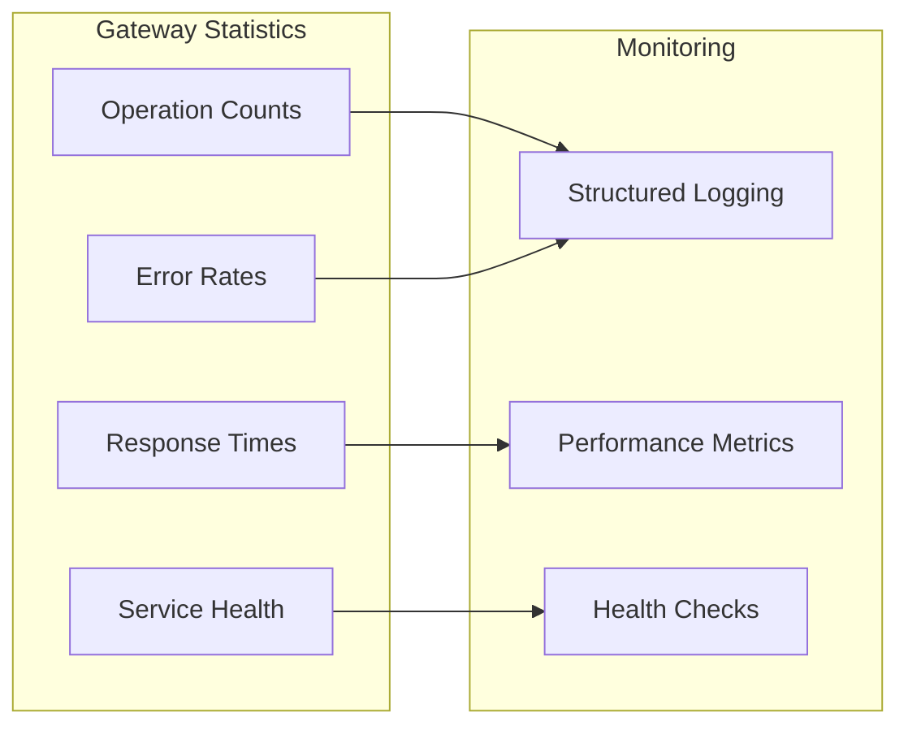
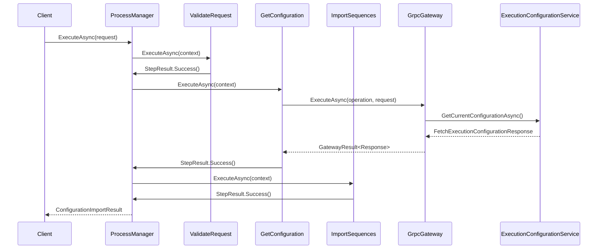
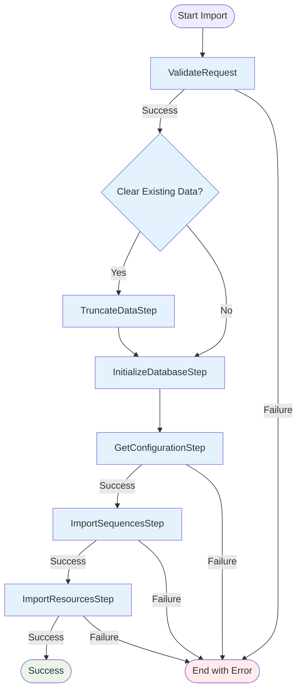
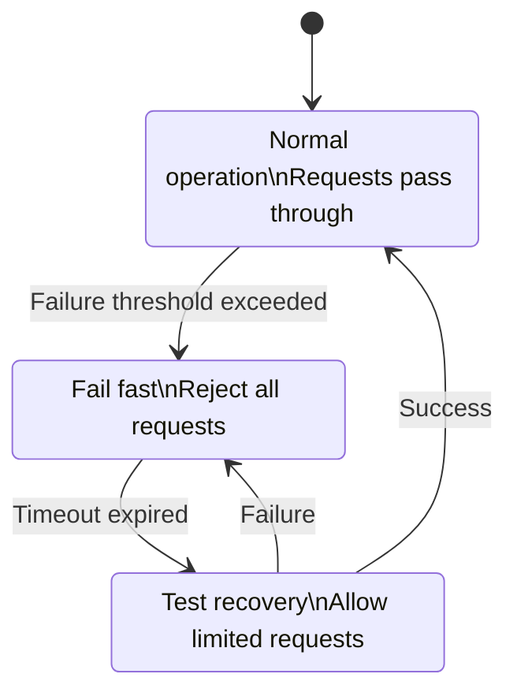
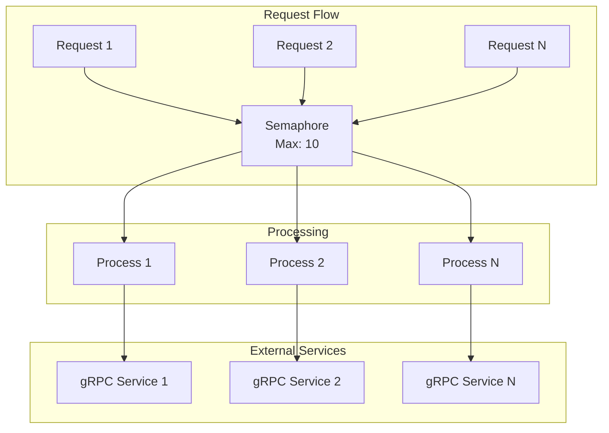
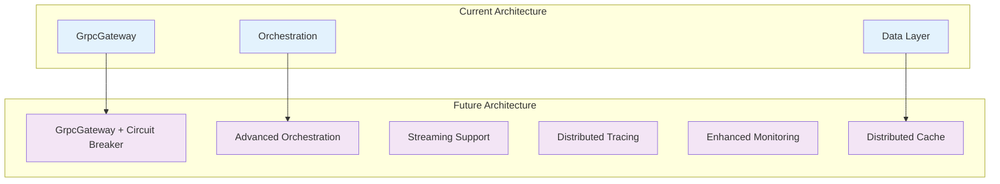

# Scheduler-Data: GrpcGateway and Orchestration Integration

## Executive Summary

This pull request introduces the **GrpcGateway** and **Orchestration** components to the scheduler-Data solution, implementing enterprise-grade patterns for external service communication and complex workflow management. These components provide the foundation for reliable, scalable operations in laboratory instrument scheduling scenarios.

### Key Additions

- **Thread-safe gRPC Gateway** with retry policies, concurrency control, and comprehensive statistics
- **Process Manager Pattern** implementation for orchestrating multi-step workflows
- **Configuration Import Orchestration** demonstrating real-world usage patterns
- **Robust error handling** and **monitoring capabilities**

---

## Table of Contents

1. [Architecture Overview](#architecture-overview)
2. [GrpcGateway Component](#grpcgateway-component)
3. [Orchestration Framework](#orchestration-framework)
4. [Configuration Import Workflow](#configuration-import-workflow)
5. [Integration Patterns](#integration-patterns)
6. [Error Handling & Resilience](#error-handling--resilience)
7. [Usage Examples](#usage-examples)
8. [Testing Strategy](#testing-strategy)
9. [Performance Considerations](#performance-considerations)
10. [Future Enhancements](#future-enhancements)

---

## Architecture Overview

The scheduler-Data solution implements a layered architecture with clear separation of concerns:



### Design Principles

1. **Separation of Concerns**: Clear boundaries between communication, orchestration, and data layers
2. **Resilience**: Built-in retry mechanisms, timeout handling, and graceful degradation
3. **Observability**: Comprehensive logging, statistics, and monitoring capabilities
4. **Scalability**: Thread-safe implementations with configurable concurrency limits
5. **Testability**: Dependency injection and interface-based design for easy testing

---

## GrpcGateway Component

The GrpcGateway serves as a centralized, thread-safe communication hub for all external gRPC service interactions.

### Core Features

#### Thread-Safe Operations
```csharp
public class GrpcGateway : IGrpcGateway, IDisposable
{
    private readonly SemaphoreSlim _semaphore;
    private readonly GatewayStatistics _statistics;
    private volatile bool _disposed;
    
    public async Task<GatewayResult<TResponse>> ExecuteAsync<TRequest, TResponse>(
        IGrpcOperation<TRequest, TResponse> operation,
        TRequest request,
        CancellationToken cancellationToken = default)
    {
        await _semaphore.WaitAsync(cancellationToken);
        try
        {
            // Execute with retry policy and timeout handling
            var result = await _retryPolicy.ExecuteAsync(async ct => {
                var timeout = GetTimeout(operation.Timeout);
                using var timeoutCts = new CancellationTokenSource(timeout);
                using var linkedCts = CancellationTokenSource.CreateLinkedTokenSource(timeoutCts.Token, ct);
                
                return await operation.ExecuteAsync(request);
            }, cancellationToken);
            
            _statistics.IncrementOperation(operationKey);
            return GatewayResult<TResponse>.Success(result, stopwatch.Elapsed);
        }
        finally
        {
            _semaphore.Release();
        }
    }
}
```

#### Configuration Options
```csharp
public class GrpcGatewayOptions
{
    public int DefaultTimeoutSeconds { get; set; } = 30;
    public int MaxConcurrentRequests { get; set; } = 10;
    public RetryOptions RetryOptions { get; set; } = new();
}

public class RetryOptions
{
    public int MaxAttempts { get; set; } = 3;
    public int BaseDelayMs { get; set; } = 1000;
    public double BackoffMultiplier { get; set; } = 2.0;
    public bool UseJitter { get; set; } = true;
}
```

### Gateway Statistics

Real-time monitoring capabilities provide insights into system performance:



### Operation Factory Pattern

Encapsulates service-specific operation creation:

```csharp
public interface IExecutionConfigurationOperationFactory : IGrpcOperationFactory
{
    IGrpcOperation<FetchExecutionConfigurationRequest, FetchExecutionConfigurationResponse>
        CreateGetCurrentConfigurationOperation();
        
    IGrpcOperation<FetchSequenceConfigurationRequest, FetchSequenceConfigurationResponse>
        CreateGetSequenceConfigurationOperation();
        
    IGrpcOperation<FetchResourceConfigurationRequest, FetchResourceConfigurationResponse>
        CreateGetResourceConfigurationOperation();
}
```

---

## Orchestration Framework

The orchestration framework implements the **Process Manager pattern** to coordinate complex, multi-step workflows with proper error handling and state management.

### Core Components

#### OrchestrationContext
Shared state container that flows through all orchestration steps:

```csharp
public class OrchestrationContext
{
    public Dictionary<string, object?> Data { get; } = [];
    public List<string> CompletedSteps { get; } = [];
    public List<string> Errors { get; } = [];

    public T? GetData<T>(string key) => 
        Data.TryGetValue(key, out var value) ? (T?)value : default;

    public void SetData<T>(string key, T value) => Data[key] = value;
}
```

#### IOrchestrationStep Interface
Standardized contract for all orchestration steps:

```csharp
public interface IOrchestrationStep
{
    string StepName { get; }
    Task<StepResult> ExecuteAsync(OrchestrationContext context, CancellationToken cancellationToken);
}
```

#### IProcessManager Interface
Generic process manager contract:

```csharp
public interface IProcessManager<in TRequest, TResult>
{
    Task<TResult> ExecuteAsync(TRequest request, CancellationToken cancellationToken = default);
}
```

### Orchestration Flow



---

## Configuration Import Workflow

The configuration import process demonstrates a real-world orchestration scenario with multiple coordinated steps.

### Workflow Steps



### Step Implementation Example

```csharp
public class GetConfigurationStep : IOrchestrationStep
{
    private readonly IGrpcGateway _gateway;
    private readonly ILogger<GetConfigurationStep> _logger;

    public string StepName => "GetConfiguration";

    public async Task<StepResult> ExecuteAsync(OrchestrationContext context, CancellationToken cancellationToken)
    {
        var request = context.GetData<ConfigurationImportRequest>("ImportRequest");
        
        try
        {
            var operation = _gateway.ExecutionConfigurationOperations.CreateGetCurrentConfigurationOperation();
            var grpcRequest = new FetchExecutionConfigurationRequest(request is { IncludeSequences: true });

            var result = await _gateway.ExecuteAsync(operation, grpcRequest, cancellationToken);

            if (!result.IsSuccess)
                return StepResult.Failure($"Failed to fetch configuration: {result.ErrorMessage}");

            if (result.Data?.Configuration == null)
                return StepResult.Failure("Configuration is null in response");

            // Store results in context for subsequent steps
            context.SetData("FetchedConfiguration", result.Data.Configuration);
            context.SetData("RequestId", result.Data.RequestId);

            _logger.LogInformation("Configuration fetched successfully. Sequences: {SequenceCount}",
                result.Data.Configuration.Sequences.Count);

            return StepResult.Success();
        }
        catch (Exception ex)
        {
            _logger.LogError(ex, "Failed to fetch configuration from ExecutionConfigurationService");
            return StepResult.Failure($"Failed to fetch configuration: {ex.Message}");
        }
    }
}
```

### Configuration Import Manager

```csharp
public class ConfigurationImportManager : IProcessManager<ConfigurationImportRequest, ConfigurationImportResult>
{
    private readonly IEnumerable<IOrchestrationStep> _steps;
    private readonly ILogger<ConfigurationImportManager> _logger;

    public async Task<ConfigurationImportResult> ExecuteAsync(
        ConfigurationImportRequest request, 
        CancellationToken cancellationToken = default)
    {
        var context = new OrchestrationContext();
        var result = new ConfigurationImportResult();
        
        // Store request in context
        context.SetData("ImportRequest", request);
        context.SetData("Statistics", new ImportStatistics());

        foreach (var step in _steps.OrderBy(s => GetStepOrder(s.StepName)))
        {
            var stepResult = await step.ExecuteAsync(context, cancellationToken);
            context.CompletedSteps.Add(step.StepName);

            if (!stepResult.IsSuccess)
            {
                var error = $"Step '{step.StepName}' failed: {stepResult.ErrorMessage}";
                context.Errors.Add(error);
                
                if (!stepResult.ShouldContinue)
                {
                    result.IsSuccess = false;
                    result.ErrorMessage = error;
                    break;
                }
            }
        }

        // Extract final results from context
        result.Statistics = context.GetData<ImportStatistics>("Statistics") ?? new ImportStatistics();
        result.ProcessedSteps = [..context.CompletedSteps];
        
        return result;
    }
}
```

---

## Integration Patterns

### Dependency Injection Configuration

```csharp
public static class ServiceCollectionExtensions
{
    public static IServiceCollection AddGrpcGateway(this IServiceCollection services, IConfiguration configuration)
    {
        services.Configure<GrpcGatewayOptions>(configuration.GetSection("GrpcGateway"));
        
        services.AddSingleton<IRetryPolicy, ExponentialBackoffRetryPolicy>();
        services.AddSingleton<IGrpcGateway, GrpcGateway>();
        services.AddTransient<IExecutionConfigurationOperationFactory, ExecutionConfigurationOperationFactory>();
        
        return services;
    }
    
    public static IServiceCollection AddOrchestration(this IServiceCollection services)
    {
        // Register orchestration steps
        services.AddTransient<IOrchestrationStep, ValidateRequestStep>();
        services.AddTransient<IOrchestrationStep, GetConfigurationStep>();
        services.AddTransient<IOrchestrationStep, ImportSequencesStep>();
        services.AddTransient<IOrchestrationStep, ImportResourcesStep>();
        
        // Register process managers
        services.AddTransient<IProcessManager<ConfigurationImportRequest, ConfigurationImportResult>, 
            ConfigurationImportManager>();
        
        return services;
    }
}
```

### Configuration Example

```json
{
  "GrpcGateway": {
    "DefaultTimeoutSeconds": 30,
    "MaxConcurrentRequests": 10,
    "RetryOptions": {
      "MaxAttempts": 3,
      "BaseDelayMs": 1000,
      "BackoffMultiplier": 2.0,
      "UseJitter": true
    }
  },
  "ExecutionConfigurationService": {
    "Endpoint": "https://localhost:5001",
    "Timeout": "00:02:00"
  }
}
```

---

## Error Handling & Resilience

### Retry Policy Implementation

```csharp
public class ExponentialBackoffRetryPolicy : IRetryPolicy
{
    private readonly RetryOptions _options;
    private readonly Random _random = new();

    public async Task<T> ExecuteAsync<T>(Func<CancellationToken, Task<T>> operation, CancellationToken cancellationToken)
    {
        Exception? lastException = null;
        
        for (int attempt = 1; attempt <= _options.MaxAttempts; attempt++)
        {
            try
            {
                return await operation(cancellationToken);
            }
            catch (Exception ex) when (ShouldRetry(ex, attempt))
            {
                lastException = ex;
                
                if (attempt < _options.MaxAttempts)
                {
                    var delay = CalculateDelay(attempt);
                    await Task.Delay(delay, cancellationToken);
                }
            }
        }
        
        throw lastException ?? new InvalidOperationException("Retry policy failed");
    }

    private TimeSpan CalculateDelay(int attempt)
    {
        var baseDelay = _options.BaseDelayMs * Math.Pow(_options.BackoffMultiplier, attempt - 1);
        
        if (_options.UseJitter)
        {
            var jitter = _random.NextDouble() * baseDelay * 0.1; // 10% jitter
            baseDelay += jitter;
        }
        
        return TimeSpan.FromMilliseconds(baseDelay);
    }
}
```

### Step-Level Error Handling

```csharp
public class StepResult
{
    public bool IsSuccess { get; set; }
    public string? ErrorMessage { get; set; }
    public bool ShouldContinue { get; set; } = true; // Continue even if this step fails

    public static StepResult Success() => new() { IsSuccess = true };
    
    public static StepResult Failure(string error, bool shouldContinue = false) => new()
    {
        IsSuccess = false,
        ErrorMessage = error,
        ShouldContinue = shouldContinue
    };
}
```

### Circuit Breaker Pattern (Future Enhancement)



---

## Usage Examples

### Basic Gateway Usage

```csharp
public class ConfigurationService
{
    private readonly IGrpcGateway _gateway;

    public async Task<ExecutionConfigurationContract> GetCurrentConfigurationAsync()
    {
        var operation = _gateway.ExecutionConfigurationOperations.CreateGetCurrentConfigurationOperation();
        var request = new FetchExecutionConfigurationRequest(includeSequences: true);
        
        var result = await _gateway.ExecuteAsync(operation, request);
        
        if (!result.IsSuccess)
            throw new InvalidOperationException($"Failed to get configuration: {result.ErrorMessage}");
            
        return result.Data.Configuration;
    }
}
```

### Orchestration Usage

```csharp
public class ImportController
{
    private readonly IProcessManager<ConfigurationImportRequest, ConfigurationImportResult> _processManager;

    public async Task<IActionResult> ImportConfiguration(ConfigurationImportRequest request)
    {
        try
        {
            var result = await _processManager.ExecuteAsync(request);
            
            if (result.IsSuccess)
            {
                return Ok(new 
                { 
                    Success = true, 
                    Duration = result.Duration,
                    Statistics = result.Statistics,
                    ProcessedSteps = result.ProcessedSteps
                });
            }
            
            return BadRequest(new { Error = result.ErrorMessage });
        }
        catch (Exception ex)
        {
            return StatusCode(500, new { Error = ex.Message });
        }
    }
}
```

### Custom Orchestration Step

```csharp
public class CustomValidationStep : IOrchestrationStep
{
    public string StepName => "CustomValidation";

    public async Task<StepResult> ExecuteAsync(OrchestrationContext context, CancellationToken cancellationToken)
    {
        var request = context.GetData<ConfigurationImportRequest>("ImportRequest");
        
        // Perform custom validation logic
        if (request.SequenceFilters.Count > 100)
        {
            return StepResult.Failure("Too many sequence filters specified", shouldContinue: false);
        }
        
        // Store validation results
        context.SetData("ValidationTimestamp", DateTimeOffset.UtcNow);
        
        return StepResult.Success();
    }
}
```

---

## Testing Strategy

### Unit Testing Approaches

#### Gateway Testing
```csharp
[Test]
public async Task ExecuteAsync_WithSuccessfulOperation_ReturnsSuccessResult()
{
    // Arrange
    var mockRetryPolicy = new Mock<IRetryPolicy>();
    var mockOperation = new Mock<IGrpcOperation<TestRequest, TestResponse>>();
    var gateway = new GrpcGateway(mockRetryPolicy.Object, logger, options, factory);
    
    mockRetryPolicy.Setup(x => x.ExecuteAsync(It.IsAny<Func<CancellationToken, Task<TestResponse>>>(), It.IsAny<CancellationToken>()))
        .ReturnsAsync(new TestResponse());
    
    // Act
    var result = await gateway.ExecuteAsync(mockOperation.Object, new TestRequest());
    
    // Assert
    Assert.IsTrue(result.IsSuccess);
    Assert.IsNotNull(result.Data);
}
```

#### Orchestration Testing
```csharp
[Test]
public async Task ExecuteAsync_WithFailingStep_ReturnsFailureResult()
{
    // Arrange
    var steps = new List<IOrchestrationStep>
    {
        new Mock<IOrchestrationStep>().Object,
        CreateFailingStep()
    };
    var manager = new ConfigurationImportManager(steps, logger);
    
    // Act
    var result = await manager.ExecuteAsync(new ConfigurationImportRequest());
    
    // Assert
    Assert.IsFalse(result.IsSuccess);
    Assert.IsNotNull(result.ErrorMessage);
}
```

### Integration Testing

```csharp
[Test]
public async Task FullConfigurationImport_WithRealServices_CompletesSuccessfully()
{
    // Arrange
    var services = new ServiceCollection()
        .AddGrpcGateway(configuration)
        .AddOrchestration()
        .BuildServiceProvider();
    
    var processManager = services.GetRequiredService<IProcessManager<ConfigurationImportRequest, ConfigurationImportResult>>();
    
    // Act
    var result = await processManager.ExecuteAsync(new ConfigurationImportRequest
    {
        IncludeSequences = true,
        ClearExistingData = false
    });
    
    // Assert
    Assert.IsTrue(result.IsSuccess);
    Assert.IsTrue(result.ProcessedSteps.Count > 0);
}
```

---

## Performance Considerations

### Concurrency Management



### Memory Management
- **Context Cleanup**: OrchestrationContext automatically clears data after completion
- **Disposable Pattern**: GrpcGateway implements IDisposable for proper resource cleanup
- **Streaming Support**: Ready for large data transfers (future enhancement)

### Monitoring Metrics

| Metric | Description | Usage |
|--------|-------------|-------|
| `gateway.requests.total` | Total requests processed | Load monitoring |
| `gateway.requests.duration` | Request duration histogram | Performance analysis |
| `gateway.errors.total` | Total errors by type | Error rate monitoring |
| `orchestration.steps.duration` | Step execution times | Workflow optimization |

---

## Future Enhancements

### Planned Improvements

1. **Circuit Breaker Pattern**
   - Implement circuit breaker for external service protection
   - Configurable failure thresholds and recovery timeouts

2. **Distributed Tracing**
   - OpenTelemetry integration for request tracing
   - Correlation IDs across service boundaries

3. **Advanced Orchestration Features**
   - Parallel step execution
   - Conditional step execution
   - Step rollback capabilities

4. **Enhanced Monitoring**
   - Prometheus metrics export
   - Health check endpoints
   - Performance dashboards

5. **Streaming Support**
   - gRPC streaming for large data transfers
   - Progressive result reporting

### Architecture Evolution



---

## Conclusion

The GrpcGateway and Orchestration components represent a significant advancement in the scheduler-Data solution's architecture. These components provide:

- **Robust Communication**: Thread-safe, resilient gRPC service integration
- **Workflow Management**: Flexible, extensible orchestration capabilities
- **Operational Excellence**: Comprehensive monitoring and error handling
- **Scalability**: Foundation for future enhancements and growth

The implementation follows established enterprise patterns and provides a solid foundation for complex laboratory instrument scheduling scenarios. The modular design ensures easy testing, maintenance, and future enhancements.

### Benefits Delivered

✅ **Reliability**: Built-in retry mechanisms and error handling  
✅ **Observability**: Comprehensive logging and statistics  
✅ **Maintainability**: Clean separation of concerns and testable components  
✅ **Scalability**: Thread-safe operations with configurable concurrency  
✅ **Extensibility**: Plugin-based orchestration step architecture  

This integration significantly enhances the solution's capability to handle complex, multi-step workflows while maintaining high reliability and performance standards expected in laboratory environments.